## Task 1: Defining custom topologies
 First have a python script to setup the network.

 Then To run the binary_tree.py script inside your Docker container, you'll first need to make sure that the script is available inside the container. Here's how you can do it:

 ```sh
 sudo docker cp /path/to/binary_tree.py mininet:/binary_tree.py

 ```

 Once you're inside the container, navigate to the location where you copied the script and run it with:

 ```sh
 cd /
mn --custom binary_tree.py --topo binary_tree

 ```

```sh
root@723ebefc3cf1:/# mn --custom binary_tree.py --topo binary_tree
*** Error setting resource limits. Mininet's performance may be affected.
*** Creating network
*** Adding controller
*** Adding hosts:
h1 h2 h3 h4 h5 h6 h7 h8 
*** Adding switches:
s1 s2 s3 s4 s5 s6 s7 
*** Adding links:
(s1, s2) (s1, s5) (s2, s3) (s2, s4) (s3, h1) (s3, h2) (s4, h3) (s4, h4) (s5, s6) (s5, s7) (s6, h5) (s6, h6) (s7, h7) (s7, h8) 
*** Configuring hosts
h1 h2 h3 h4 h5 h6 h7 h8 
*** Starting controller
c0 
*** Starting 7 switches
s1 s2 s3 s4 s5 s6 s7 ...
*** Starting CLI:
mininet> h1 ping h8
PING 10.0.0.8 (10.0.0.8) 56(84) bytes of data.
64 bytes from 10.0.0.8: icmp_seq=1 ttl=64 time=13.8 ms
64 bytes from 10.0.0.8: icmp_seq=2 ttl=64 time=0.545 ms
64 bytes from 10.0.0.8: icmp_seq=3 ttl=64 time=0.063 ms
64 bytes from 10.0.0.8: icmp_seq=4 ttl=64 time=0.073 ms
64 bytes from 10.0.0.8: icmp_seq=5 ttl=64 time=0.066 ms
64 bytes from 10.0.0.8: icmp_seq=6 ttl=64 time=0.079 ms
64 bytes from 10.0.0.8: icmp_seq=7 ttl=64 time=0.080 ms
64 bytes from 10.0.0.8: icmp_seq=8 ttl=64 time=0.083 ms
64 bytes from 10.0.0.8: icmp_seq=9 ttl=64 time=0.078 ms
64 bytes from 10.0.0.8: icmp_seq=10 ttl=64 time=0.076 ms
64 bytes from 10.0.0.8: icmp_seq=11 ttl=64 time=0.083 ms
64 bytes from 10.0.0.8: icmp_seq=12 ttl=64 time=0.068 ms
64 bytes from 10.0.0.8: icmp_seq=13 ttl=64 time=0.074 ms
64 bytes from 10.0.0.8: icmp_seq=14 ttl=64 time=0.077 ms
64 bytes from 10.0.0.8: icmp_seq=15 ttl=64 time=0.078 ms
64 bytes from 10.0.0.8: icmp_seq=16 ttl=64 time=0.077 ms
64 bytes from 10.0.0.8: icmp_seq=17 ttl=64 time=0.075 ms
64 bytes from 10.0.0.8: icmp_seq=18 ttl=64 time=0.076 ms
64 bytes from 10.0.0.8: icmp_seq=19 ttl=64 time=0.074 ms
64 bytes from 10.0.0.8: icmp_seq=20 ttl=64 time=0.081 ms
64 bytes from 10.0.0.8: icmp_seq=21 ttl=64 time=0.077 ms
64 bytes from 10.0.0.8: icmp_seq=22 ttl=64 time=0.077 ms
64 bytes from 10.0.0.8: icmp_seq=23 ttl=64 time=0.080 ms
64 bytes from 10.0.0.8: icmp_seq=24 ttl=64 time=0.081 ms
64 bytes from 10.0.0.8: icmp_seq=25 ttl=64 time=0.076 ms
64 bytes from 10.0.0.8: icmp_seq=26 ttl=64 time=0.084 ms
^C
--- 10.0.0.8 ping statistics ---
26 packets transmitted, 26 received, 0% packet loss, time 25562ms
rtt min/avg/max/mdev = 0.063/0.623/13.841/2.644 ms
```
Questions
1. What is the output of “nodes” and “net”
```sh
mininet> nodes
available nodes are: 
c0 h1 h2 h3 h4 h5 h6 h7 h8 s1 s2 s3 s4 s5 s6 s7

mininet> net
h1 h1-eth0:s3-eth2
h2 h2-eth0:s3-eth3
h3 h3-eth0:s4-eth2
h4 h4-eth0:s4-eth3
h5 h5-eth0:s6-eth2
h6 h6-eth0:s6-eth3
h7 h7-eth0:s7-eth2
h8 h8-eth0:s7-eth3
s1 lo:  s1-eth1:s2-eth1 s1-eth2:s5-eth1
s2 lo:  s2-eth1:s1-eth1 s2-eth2:s3-eth1 s2-eth3:s4-eth1
s3 lo:  s3-eth1:s2-eth2 s3-eth2:h1-eth0 s3-eth3:h2-eth0
s4 lo:  s4-eth1:s2-eth3 s4-eth2:h3-eth0 s4-eth3:h4-eth0
s5 lo:  s5-eth1:s1-eth2 s5-eth2:s6-eth1 s5-eth3:s7-eth1
s6 lo:  s6-eth1:s5-eth2 s6-eth2:h5-eth0 s6-eth3:h6-eth0
s7 lo:  s7-eth1:s5-eth3 s7-eth2:h7-eth0 s7-eth3:h8-eth0
c0
```
2. What is the output of “h7 ifconfig”

```sh
mininet> h7 ifconfig
h7-eth0: flags=4163<UP,BROADCAST,RUNNING,MULTICAST>  mtu 1500
        inet 10.0.0.7  netmask 255.0.0.0  broadcast 10.255.255.255
        inet6 fe80::f8bd:5bff:fe60:2298  prefixlen 64  scopeid 0x20<link>
        ether fa:bd:5b:60:22:98  txqueuelen 1000  (Ethernet)
        RX packets 71  bytes 5454 (5.4 KB)
        RX errors 0  dropped 0  overruns 0  frame 0
        TX packets 12  bytes 936 (936.0 B)
        TX errors 0  dropped 0 overruns 0  carrier 0  collisions 0

lo: flags=73<UP,LOOPBACK,RUNNING>  mtu 65536
        inet 127.0.0.1  netmask 255.0.0.0
        inet6 ::1  prefixlen 128  scopeid 0x10<host>
        loop  txqueuelen 1000  (Local Loopback)
        RX packets 0  bytes 0 (0.0 B)
        RX errors 0  dropped 0  overruns 0  frame 0
        TX packets 0  bytes 0 (0.0 B)
        TX errors 0  dropped 0 overruns 0  carrier 0  collisions 0

```

## Install POX

Once POX is installed via git clone, you can run POX by running the following commands:
```sh
$ ./pox.py log.level --DEBUG misc.of_tutorial
POX 0.7.0 (gar) / Copyright 2011-2020 James McCauley, et al.
DEBUG:core:POX 0.7.0 (gar) going up...
DEBUG:core:Running on CPython (3.10.6/Mar 10 2023 10:55:28)
DEBUG:core:Platform is Linux-6.2.0-1018-aws-x86_64-with-glibc2.35
WARNING:version:POX requires one of the following versions of Python: 3.6 3.7 3.8 3.9
WARNING:version:You're running Python 3.10.
WARNING:version:If you run into problems, try using a supported version.
INFO:core:POX 0.7.0 (gar) is up.
DEBUG:openflow.of_01:Listening on 0.0.0.0:6633
```
You must run this while pox.py is running in a separate shell. Once you do this, this will connect
all switches to the controller. Please take a look at the output from the controller console.
```sh
INFO:openflow.of_01:[00-00-00-00-00-07 1] connected
DEBUG:misc.of_tutorial:Controlling [00-00-00-00-00-07 1]
INFO:openflow.of_01:[00-00-00-00-00-06 2] connected
DEBUG:misc.of_tutorial:Controlling [00-00-00-00-00-06 2]
INFO:openflow.of_01:[00-00-00-00-00-04 3] connected
DEBUG:misc.of_tutorial:Controlling [00-00-00-00-00-04 3]
INFO:openflow.of_01:[00-00-00-00-00-01 4] connected
DEBUG:misc.of_tutorial:Controlling [00-00-00-00-00-01 4]
INFO:openflow.of_01:[00-00-00-00-00-05 5] connected
DEBUG:misc.of_tutorial:Controlling [00-00-00-00-00-05 5]
INFO:openflow.of_01:[00-00-00-00-00-03 6] connected
DEBUG:misc.of_tutorial:Controlling [00-00-00-00-00-03 6]
INFO:openflow.of_01:[00-00-00-00-00-02 7] connected
DEBUG:misc.of_tutorial:Controlling [00-00-00-00-00-02 7]
```

The output shows that seven connections have been established, which corresponds to the seven switches in your Mininet topology. Each line indicating a connection shows that a switch has successfully connected to the POX controller and is now being managed by it. This setup is what the expect for the topology, with each switch connecting to the controller when running Mininet with the --controller remote option.

## Task 2: Analyze the “of_tutorial’ controller

Questions
1. Draw the function call graph of this controller. For example, once a packet comes to the
controller, which function is the first to be called, which one is the second, and so forth?

For the of_tutorial controller, the function call graph starts when a switch connects to the controller, triggering start_switch due to a "ConnectionUp" event. This function instantiates the Tutorial class with the switch connection. Inside Tutorial, connection.addListeners(self) listens for a "PacketIn" event, leading to _handle_PacketIn when a packet arrives at the controller with no matching flow entry in the switch.

When a packet arrives at the controller without a matching flow in the switch, the first function called is _handle_PacketIn().

If  controller does not learn or store MAC addresses and ports. Instead, it floods every incoming packet to all ports except the one it arrived on, mimicking the behavior of a traditional Ethernet hub._handle_PacketIn() calls act_like_hub(), which then calls resend_packet() to flood the packet.

If the controller learns the source MAC address and port from incoming packets and uses this information to make forwarding decisions. If it knows the port for the destination MAC address, it forwards the packet only to that port. within _handle_PacketIn(), act_like_switch() would be called instead, potentially leading to resend_packet() for known destinations



2. Have h1 ping h2, and h1 ping h8 for 100 times (e.g., h1 ping -c100 p2).

a. How long does it take (on average) to ping for each case?
b. What is the minimum and maximum ping you have observed?
c. What is the difference, and why?

```sh
mininet> h1 ping -c 100 h2
PING 10.0.0.2 (10.0.0.2) 56(84) bytes of data.
64 bytes from 10.0.0.2: icmp_seq=1 ttl=64 time=5.02 ms

64 bytes from 10.0.0.2: icmp_seq=2 ttl=64 time=1.83 ms
64 bytes from 10.0.0.2: icmp_seq=3 ttl=64 time=1.81 ms
64 bytes from 10.0.0.2: icmp_seq=4 ttl=64 time=1.83 ms
64 bytes from 10.0.0.2: icmp_seq=5 ttl=64 time=1.99 ms
64 bytes from 10.0.0.2: icmp_seq=6 ttl=64 time=1.81 ms
64 bytes from 10.0.0.2: icmp_seq=7 ttl=64 time=1.89 ms
64 bytes from 10.0.0.2: icmp_seq=8 ttl=64 time=1.95 ms
64 bytes from 10.0.0.2: icmp_seq=9 ttl=64 time=1.84 ms
64 bytes from 10.0.0.2: icmp_seq=10 ttl=64 time=1.69 ms
64 bytes from 10.0.0.2: icmp_seq=11 ttl=64 time=1.58 ms
64 bytes from 10.0.0.2: icmp_seq=12 ttl=64 time=2.01 ms
64 bytes from 10.0.0.2: icmp_seq=13 ttl=64 time=2.00 ms
64 bytes from 10.0.0.2: icmp_seq=14 ttl=64 time=2.10 ms
64 bytes from 10.0.0.2: icmp_seq=15 ttl=64 time=1.73 ms
64 bytes from 10.0.0.2: icmp_seq=16 ttl=64 time=1.65 ms
64 bytes from 10.0.0.2: icmp_seq=17 ttl=64 time=1.99 ms
64 bytes from 10.0.0.2: icmp_seq=18 ttl=64 time=1.91 ms
64 bytes from 10.0.0.2: icmp_seq=19 ttl=64 time=1.92 ms
64 bytes from 10.0.0.2: icmp_seq=20 ttl=64 time=1.95 ms
64 bytes from 10.0.0.2: icmp_seq=21 ttl=64 time=1.86 ms
64 bytes from 10.0.0.2: icmp_seq=22 ttl=64 time=1.66 ms
64 bytes from 10.0.0.2: icmp_seq=23 ttl=64 time=2.08 ms
64 bytes from 10.0.0.2: icmp_seq=24 ttl=64 time=1.70 ms
64 bytes from 10.0.0.2: icmp_seq=25 ttl=64 time=2.11 ms
64 bytes from 10.0.0.2: icmp_seq=26 ttl=64 time=1.68 ms
64 bytes from 10.0.0.2: icmp_seq=27 ttl=64 time=1.60 ms
64 bytes from 10.0.0.2: icmp_seq=28 ttl=64 time=2.29 ms
64 bytes from 10.0.0.2: icmp_seq=29 ttl=64 time=1.89 ms
64 bytes from 10.0.0.2: icmp_seq=30 ttl=64 time=2.06 ms
64 bytes from 10.0.0.2: icmp_seq=31 ttl=64 time=1.79 ms
64 bytes from 10.0.0.2: icmp_seq=32 ttl=64 time=1.66 ms
64 bytes from 10.0.0.2: icmp_seq=33 ttl=64 time=1.83 ms
64 bytes from 10.0.0.2: icmp_seq=34 ttl=64 time=1.80 ms
64 bytes from 10.0.0.2: icmp_seq=35 ttl=64 time=1.79 ms
64 bytes from 10.0.0.2: icmp_seq=36 ttl=64 time=1.72 ms
64 bytes from 10.0.0.2: icmp_seq=37 ttl=64 time=1.87 ms
64 bytes from 10.0.0.2: icmp_seq=38 ttl=64 time=1.76 ms
64 bytes from 10.0.0.2: icmp_seq=39 ttl=64 time=1.87 ms
64 bytes from 10.0.0.2: icmp_seq=40 ttl=64 time=2.12 ms
64 bytes from 10.0.0.2: icmp_seq=41 ttl=64 time=1.79 ms
64 bytes from 10.0.0.2: icmp_seq=42 ttl=64 time=1.76 ms
64 bytes from 10.0.0.2: icmp_seq=43 ttl=64 time=1.66 ms
64 bytes from 10.0.0.2: icmp_seq=44 ttl=64 time=1.72 ms
64 bytes from 10.0.0.2: icmp_seq=45 ttl=64 time=1.78 ms
64 bytes from 10.0.0.2: icmp_seq=46 ttl=64 time=1.77 ms
64 bytes from 10.0.0.2: icmp_seq=47 ttl=64 time=1.74 ms
64 bytes from 10.0.0.2: icmp_seq=48 ttl=64 time=1.89 ms
64 bytes from 10.0.0.2: icmp_seq=49 ttl=64 time=1.95 ms
64 bytes from 10.0.0.2: icmp_seq=50 ttl=64 time=1.80 ms
64 bytes from 10.0.0.2: icmp_seq=51 ttl=64 time=1.66 ms
64 bytes from 10.0.0.2: icmp_seq=52 ttl=64 time=1.83 ms
64 bytes from 10.0.0.2: icmp_seq=53 ttl=64 time=1.62 ms
64 bytes from 10.0.0.2: icmp_seq=54 ttl=64 time=2.07 ms
64 bytes from 10.0.0.2: icmp_seq=55 ttl=64 time=1.81 ms
64 bytes from 10.0.0.2: icmp_seq=56 ttl=64 time=1.76 ms
64 bytes from 10.0.0.2: icmp_seq=57 ttl=64 time=1.73 ms
64 bytes from 10.0.0.2: icmp_seq=58 ttl=64 time=1.70 ms
64 bytes from 10.0.0.2: icmp_seq=59 ttl=64 time=1.77 ms
64 bytes from 10.0.0.2: icmp_seq=60 ttl=64 time=1.97 ms
64 bytes from 10.0.0.2: icmp_seq=61 ttl=64 time=1.75 ms
64 bytes from 10.0.0.2: icmp_seq=62 ttl=64 time=2.23 ms
64 bytes from 10.0.0.2: icmp_seq=63 ttl=64 time=1.79 ms
64 bytes from 10.0.0.2: icmp_seq=64 ttl=64 time=1.75 ms
64 bytes from 10.0.0.2: icmp_seq=65 ttl=64 time=1.75 ms
64 bytes from 10.0.0.2: icmp_seq=66 ttl=64 time=1.68 ms
64 bytes from 10.0.0.2: icmp_seq=67 ttl=64 time=2.31 ms
64 bytes from 10.0.0.2: icmp_seq=68 ttl=64 time=1.60 ms
64 bytes from 10.0.0.2: icmp_seq=69 ttl=64 time=1.91 ms
64 bytes from 10.0.0.2: icmp_seq=70 ttl=64 time=1.76 ms
64 bytes from 10.0.0.2: icmp_seq=71 ttl=64 time=1.84 ms
64 bytes from 10.0.0.2: icmp_seq=72 ttl=64 time=2.17 ms
64 bytes from 10.0.0.2: icmp_seq=73 ttl=64 time=1.97 ms
64 bytes from 10.0.0.2: icmp_seq=74 ttl=64 time=1.90 ms
64 bytes from 10.0.0.2: icmp_seq=75 ttl=64 time=1.81 ms
64 bytes from 10.0.0.2: icmp_seq=76 ttl=64 time=2.01 ms
64 bytes from 10.0.0.2: icmp_seq=77 ttl=64 time=1.65 ms
64 bytes from 10.0.0.2: icmp_seq=78 ttl=64 time=1.80 ms
64 bytes from 10.0.0.2: icmp_seq=79 ttl=64 time=2.01 ms
64 bytes from 10.0.0.2: icmp_seq=80 ttl=64 time=1.70 ms
64 bytes from 10.0.0.2: icmp_seq=81 ttl=64 time=1.96 ms
64 bytes from 10.0.0.2: icmp_seq=82 ttl=64 time=2.09 ms
64 bytes from 10.0.0.2: icmp_seq=83 ttl=64 time=1.75 ms
64 bytes from 10.0.0.2: icmp_seq=84 ttl=64 time=2.01 ms
64 bytes from 10.0.0.2: icmp_seq=85 ttl=64 time=1.74 ms
64 bytes from 10.0.0.2: icmp_seq=86 ttl=64 time=1.71 ms
64 bytes from 10.0.0.2: icmp_seq=87 ttl=64 time=1.70 ms
64 bytes from 10.0.0.2: icmp_seq=88 ttl=64 time=1.75 ms
64 bytes from 10.0.0.2: icmp_seq=89 ttl=64 time=1.67 ms
64 bytes from 10.0.0.2: icmp_seq=90 ttl=64 time=1.98 ms
64 bytes from 10.0.0.2: icmp_seq=91 ttl=64 time=1.71 ms
64 bytes from 10.0.0.2: icmp_seq=92 ttl=64 time=1.72 ms
64 bytes from 10.0.0.2: icmp_seq=93 ttl=64 time=1.66 ms
64 bytes from 10.0.0.2: icmp_seq=94 ttl=64 time=1.69 ms
64 bytes from 10.0.0.2: icmp_seq=95 ttl=64 time=1.96 ms
64 bytes from 10.0.0.2: icmp_seq=96 ttl=64 time=1.73 ms
64 bytes from 10.0.0.2: icmp_seq=97 ttl=64 time=2.50 ms
64 bytes from 10.0.0.2: icmp_seq=98 ttl=64 time=1.74 ms
64 bytes from 10.0.0.2: icmp_seq=99 ttl=64 time=1.73 ms
64 bytes from 10.0.0.2: icmp_seq=100 ttl=64 time=1.76 ms

--- 10.0.0.2 ping statistics ---
100 packets transmitted, 100 received, 0% packet loss, time 99164ms
rtt min/avg/max/mdev = 1.578/1.872/5.020/0.358 ms

```
Average time: 1.872ms

Minimum time: 1.578ms

Maximum time: 5.020ms


```sh
h1 ping -c 100 h8
PING 10.0.0.8 (10.0.0.8) 56(84) bytes of data.
64 bytes from 10.0.0.8: icmp_seq=1 ttl=64 time=18.0 ms

64 bytes from 10.0.0.8: icmp_seq=2 ttl=64 time=7.62 ms
64 bytes from 10.0.0.8: icmp_seq=3 ttl=64 time=6.40 ms
64 bytes from 10.0.0.8: icmp_seq=4 ttl=64 time=6.37 ms
64 bytes from 10.0.0.8: icmp_seq=5 ttl=64 time=6.23 ms
64 bytes from 10.0.0.8: icmp_seq=6 ttl=64 time=6.34 ms
64 bytes from 10.0.0.8: icmp_seq=7 ttl=64 time=8.72 ms
64 bytes from 10.0.0.8: icmp_seq=8 ttl=64 time=6.39 ms
64 bytes from 10.0.0.8: icmp_seq=9 ttl=64 time=6.27 ms
64 bytes from 10.0.0.8: icmp_seq=10 ttl=64 time=6.37 ms
64 bytes from 10.0.0.8: icmp_seq=11 ttl=64 time=6.33 ms
64 bytes from 10.0.0.8: icmp_seq=12 ttl=64 time=8.72 ms
64 bytes from 10.0.0.8: icmp_seq=13 ttl=64 time=6.34 ms
64 bytes from 10.0.0.8: icmp_seq=14 ttl=64 time=6.15 ms
64 bytes from 10.0.0.8: icmp_seq=15 ttl=64 time=6.35 ms
64 bytes from 10.0.0.8: icmp_seq=16 ttl=64 time=6.38 ms
64 bytes from 10.0.0.8: icmp_seq=17 ttl=64 time=8.58 ms
64 bytes from 10.0.0.8: icmp_seq=18 ttl=64 time=6.21 ms
64 bytes from 10.0.0.8: icmp_seq=19 ttl=64 time=6.76 ms
64 bytes from 10.0.0.8: icmp_seq=20 ttl=64 time=6.14 ms
64 bytes from 10.0.0.8: icmp_seq=21 ttl=64 time=6.43 ms
64 bytes from 10.0.0.8: icmp_seq=22 ttl=64 time=6.02 ms
64 bytes from 10.0.0.8: icmp_seq=23 ttl=64 time=9.10 ms
64 bytes from 10.0.0.8: icmp_seq=24 ttl=64 time=6.21 ms
64 bytes from 10.0.0.8: icmp_seq=25 ttl=64 time=5.92 ms
64 bytes from 10.0.0.8: icmp_seq=26 ttl=64 time=5.88 ms
64 bytes from 10.0.0.8: icmp_seq=27 ttl=64 time=6.18 ms
64 bytes from 10.0.0.8: icmp_seq=28 ttl=64 time=8.45 ms
64 bytes from 10.0.0.8: icmp_seq=29 ttl=64 time=6.50 ms
64 bytes from 10.0.0.8: icmp_seq=30 ttl=64 time=6.38 ms
64 bytes from 10.0.0.8: icmp_seq=31 ttl=64 time=6.76 ms
64 bytes from 10.0.0.8: icmp_seq=32 ttl=64 time=6.53 ms
64 bytes from 10.0.0.8: icmp_seq=33 ttl=64 time=8.30 ms
64 bytes from 10.0.0.8: icmp_seq=34 ttl=64 time=5.99 ms
64 bytes from 10.0.0.8: icmp_seq=35 ttl=64 time=6.20 ms
64 bytes from 10.0.0.8: icmp_seq=36 ttl=64 time=6.17 ms
64 bytes from 10.0.0.8: icmp_seq=37 ttl=64 time=6.27 ms
64 bytes from 10.0.0.8: icmp_seq=38 ttl=64 time=7.73 ms
64 bytes from 10.0.0.8: icmp_seq=39 ttl=64 time=6.24 ms
64 bytes from 10.0.0.8: icmp_seq=40 ttl=64 time=5.86 ms
64 bytes from 10.0.0.8: icmp_seq=41 ttl=64 time=7.27 ms
64 bytes from 10.0.0.8: icmp_seq=42 ttl=64 time=6.37 ms
64 bytes from 10.0.0.8: icmp_seq=43 ttl=64 time=7.16 ms
64 bytes from 10.0.0.8: icmp_seq=44 ttl=64 time=6.03 ms
64 bytes from 10.0.0.8: icmp_seq=45 ttl=64 time=6.20 ms
64 bytes from 10.0.0.8: icmp_seq=46 ttl=64 time=6.08 ms
64 bytes from 10.0.0.8: icmp_seq=47 ttl=64 time=6.06 ms
64 bytes from 10.0.0.8: icmp_seq=48 ttl=64 time=8.21 ms
64 bytes from 10.0.0.8: icmp_seq=49 ttl=64 time=6.54 ms
64 bytes from 10.0.0.8: icmp_seq=50 ttl=64 time=6.63 ms
64 bytes from 10.0.0.8: icmp_seq=51 ttl=64 time=6.27 ms
64 bytes from 10.0.0.8: icmp_seq=52 ttl=64 time=6.39 ms
64 bytes from 10.0.0.8: icmp_seq=53 ttl=64 time=6.07 ms
64 bytes from 10.0.0.8: icmp_seq=54 ttl=64 time=6.71 ms
64 bytes from 10.0.0.8: icmp_seq=55 ttl=64 time=6.28 ms
64 bytes from 10.0.0.8: icmp_seq=56 ttl=64 time=6.27 ms
64 bytes from 10.0.0.8: icmp_seq=57 ttl=64 time=6.11 ms
64 bytes from 10.0.0.8: icmp_seq=58 ttl=64 time=6.50 ms
64 bytes from 10.0.0.8: icmp_seq=59 ttl=64 time=6.18 ms
64 bytes from 10.0.0.8: icmp_seq=60 ttl=64 time=6.25 ms
64 bytes from 10.0.0.8: icmp_seq=61 ttl=64 time=6.42 ms
64 bytes from 10.0.0.8: icmp_seq=62 ttl=64 time=6.19 ms
64 bytes from 10.0.0.8: icmp_seq=63 ttl=64 time=6.63 ms
64 bytes from 10.0.0.8: icmp_seq=64 ttl=64 time=6.33 ms
64 bytes from 10.0.0.8: icmp_seq=65 ttl=64 time=6.11 ms
64 bytes from 10.0.0.8: icmp_seq=66 ttl=64 time=6.52 ms
64 bytes from 10.0.0.8: icmp_seq=67 ttl=64 time=6.07 ms
64 bytes from 10.0.0.8: icmp_seq=68 ttl=64 time=6.41 ms
64 bytes from 10.0.0.8: icmp_seq=69 ttl=64 time=6.36 ms
64 bytes from 10.0.0.8: icmp_seq=70 ttl=64 time=6.23 ms
64 bytes from 10.0.0.8: icmp_seq=71 ttl=64 time=5.89 ms
64 bytes from 10.0.0.8: icmp_seq=72 ttl=64 time=6.31 ms
64 bytes from 10.0.0.8: icmp_seq=73 ttl=64 time=6.47 ms
64 bytes from 10.0.0.8: icmp_seq=74 ttl=64 time=6.26 ms
64 bytes from 10.0.0.8: icmp_seq=75 ttl=64 time=6.42 ms
64 bytes from 10.0.0.8: icmp_seq=76 ttl=64 time=6.02 ms
64 bytes from 10.0.0.8: icmp_seq=77 ttl=64 time=6.40 ms
64 bytes from 10.0.0.8: icmp_seq=78 ttl=64 time=5.95 ms
64 bytes from 10.0.0.8: icmp_seq=79 ttl=64 time=5.94 ms
64 bytes from 10.0.0.8: icmp_seq=80 ttl=64 time=8.34 ms
64 bytes from 10.0.0.8: icmp_seq=81 ttl=64 time=6.43 ms
64 bytes from 10.0.0.8: icmp_seq=82 ttl=64 time=6.57 ms
64 bytes from 10.0.0.8: icmp_seq=83 ttl=64 time=6.04 ms
64 bytes from 10.0.0.8: icmp_seq=84 ttl=64 time=6.30 ms
64 bytes from 10.0.0.8: icmp_seq=85 ttl=64 time=6.33 ms
64 bytes from 10.0.0.8: icmp_seq=86 ttl=64 time=6.83 ms
64 bytes from 10.0.0.8: icmp_seq=87 ttl=64 time=6.20 ms
64 bytes from 10.0.0.8: icmp_seq=88 ttl=64 time=6.33 ms
64 bytes from 10.0.0.8: icmp_seq=89 ttl=64 time=6.49 ms
64 bytes from 10.0.0.8: icmp_seq=90 ttl=64 time=6.21 ms
64 bytes from 10.0.0.8: icmp_seq=91 ttl=64 time=6.91 ms
64 bytes from 10.0.0.8: icmp_seq=92 ttl=64 time=6.32 ms
64 bytes from 10.0.0.8: icmp_seq=93 ttl=64 time=6.50 ms
64 bytes from 10.0.0.8: icmp_seq=94 ttl=64 time=6.18 ms
64 bytes from 10.0.0.8: icmp_seq=95 ttl=64 time=6.44 ms
64 bytes from 10.0.0.8: icmp_seq=96 ttl=64 time=6.25 ms
64 bytes from 10.0.0.8: icmp_seq=97 ttl=64 time=6.50 ms
64 bytes from 10.0.0.8: icmp_seq=98 ttl=64 time=6.71 ms
64 bytes from 10.0.0.8: icmp_seq=99 ttl=64 time=7.09 ms
64 bytes from 10.0.0.8: icmp_seq=100 ttl=64 time=6.13 ms

--- 10.0.0.8 ping statistics ---
100 packets transmitted, 100 received, 0% packet loss, time 99117ms
rtt min/avg/max/mdev = 5.860/6.653/17.971/1.323 ms
```

Average time: 6.653ms

Minimum time: 5.860ms

Maximum time: 17.971ms

Topolopy: h2 is closer to h1.Packets transported from h1 to h2 only need to pass through one switch s3.

Packets transported from h1 to h8 will have the path: s3-s2-s1-s5-s7,  which introduces additional latency compared to the direct path between h1 and h2.

3. Run “iperf h1 h2” and “iperf h1 h8”

```sh
mininet> iperf h1 h2
*** Iperf: testing TCP bandwidth between h1 and h2 
*** Results: ['10.0 Mbits/sec', '9.93 Mbits/sec']
```
```sh
mininet> iperf h1 h8
*** Iperf: testing TCP bandwidth between h1 and h8 
*** Results: ['2.86 Mbits/sec', '2.79 Mbits/sec']
```
a. What is “iperf” used for?

iperf is a tool used for measuring the maximum TCP and UDP bandwidth performance. It allows users to test the throughput of a network by generating TCP or UDP data streams and measuring the throughput between two hosts.

b. What is the throughput for each case?

Between h1 and h2: The throughput is approximately 10.0 Mbits/sec (or 9.93 Mbits/sec).

Between h1 and h8: The throughput is approximately 2.86 Mbits/sec (or 2.79 Mbits/sec).

c. What is the difference, and explain the reasons for the difference.

h1 and h2 are closer to each other and are connected to the same switch (s3), resulting in a shorter network distance and fewer network hops. This leads to lower latency and higher throughput between them.

Communication between h1 and h8 traverses multiple switches (s3, s2, s1, s5, s7), introducing more network hops and potentially encountering congestion at each switch. Each hop adds processing and forwarding delays, reducing the overall throughput.

Also higher layer switch might have bottolenect issue. They have to deal with more internel network. Thus become congested and ncreased latency.

4. Which of the switches observe traffic? Please describe your way for observing such
traffic on switches (e.g., adding some functions in the “of_tutorial” controller).

To observe traffic on switches,  enhance the of_tutorial controller to log information about incoming packets and the corresponding actions taken by the controller. 

```python
def act_like_hub(self, packet, packet_in):
    """
    Implement hub-like behavior -- send all packets to all ports besides
    the input port.
    """
    log.debug("PacketIn message received on switch %s" % (self.connection,))
    log.debug("Received packet: %s" % packet)
    
    # We want to output to all ports -- we do that using the special
    # OFPP_ALL port as the output port.  (We could have also used
    # OFPP_FLOOD.)
    self.resend_packet(packet_in, of.OFPP_ALL)

    # Log the action taken
    log.debug("Flooding packet to all ports")

    # Note that if we didn't get a valid buffer_id, a slightly better
    # implementation would check that we got the full data before
    # sending it (len(packet_in.data) should be == packet_in.total_len)).

```
h1 sends an ICMP ping request to h2.
```sh
mininet> h1 ping -c 1 h2
PING 10.0.0.2 (10.0.0.2) 56(84) bytes of data.
64 bytes from 10.0.0.2: icmp_seq=1 ttl=64 time=3.46 ms

--- 10.0.0.2 ping statistics ---
1 packets transmitted, 1 received, 0% packet loss, time 0ms
rtt min/avg/max/mdev = 3.461/3.461/3.461/0.000 ms
```
The switches in the network receive the ICMP ping request from h1 and forward it to the controller (of_tutorial) because there is no matching flow entry in their flow tables.

The controller (of_tutorial) receives the PacketIn messages from each switch indicating that a packet has arrived.

The controller floods the received packets to all ports on each switch, mimicking hub-like behavior.
```sh
mininet> h1 ping -c 1 h2
PING 10.0.0.2 (10.0.0.2) 56(84) bytes of data.
64 bytes from 10.0.0.2: icmp_seq=1 ttl=64 time=3.46 ms

--- 10.0.0.2 ping statistics ---
1 packets transmitted, 1 received, 0% packet loss, time 0ms
rtt min/avg/max/mdev = 3.461/3.461/3.461/0.000 msDEBUG:misc.of_tutorial:Controlling [00-00-00-00-00-02 7]
DEBUG:misc.of_tutorial:PacketIn message received on switch [00-00-00-00-00-03 5]
DEBUG:misc.of_tutorial:Received packet: [d6:e4:c0:c7:54:dd>de:46:93:f4:af:7b IP]
DEBUG:misc.of_tutorial:Flooding packet to all ports
DEBUG:misc.of_tutorial:PacketIn message received on switch [00-00-00-00-00-03 5]
DEBUG:misc.of_tutorial:Received packet: [de:46:93:f4:af:7b>d6:e4:c0:c7:54:dd IP]
DEBUG:misc.of_tutorial:Flooding packet to all ports
DEBUG:misc.of_tutorial:PacketIn message received on switch [00-00-00-00-00-02 7]
DEBUG:misc.of_tutorial:Received packet: [d6:e4:c0:c7:54:dd>de:46:93:f4:af:7b IP]
DEBUG:misc.of_tutorial:Flooding packet to all ports
DEBUG:misc.of_tutorial:PacketIn message received on switch [00-00-00-00-00-02 7]
DEBUG:misc.of_tutorial:Received packet: [de:46:93:f4:af:7b>d6:e4:c0:c7:54:dd IP]
DEBUG:misc.of_tutorial:Flooding packet to all ports
DEBUG:misc.of_tutorial:PacketIn message received on switch [00-00-00-00-00-04 3]
DEBUG:misc.of_tutorial:Received packet: [d6:e4:c0:c7:54:dd>de:46:93:f4:af:7b IP]
DEBUG:misc.of_tutorial:Flooding packet to all ports
DEBUG:misc.of_tutorial:PacketIn message received on switch [00-00-00-00-00-01 4]
DEBUG:misc.of_tutorial:Received packet: [d6:e4:c0:c7:54:dd>de:46:93:f4:af:7b IP]
DEBUG:misc.of_tutorial:Flooding packet to all ports
DEBUG:misc.of_tutorial:PacketIn message received on switch [00-00-00-00-00-01 4]
DEBUG:misc.of_tutorial:Received packet: [de:46:93:f4:af:7b>d6:e4:c0:c7:54:dd IP]
DEBUG:misc.of_tutorial:Flooding packet to all ports
DEBUG:misc.of_tutorial:PacketIn message received on switch [00-00-00-00-00-04 3]
DEBUG:misc.of_tutorial:Received packet: [de:46:93:f4:af:7b>d6:e4:c0:c7:54:dd IP]
DEBUG:misc.of_tutorial:Flooding packet to all ports
DEBUG:misc.of_tutorial:PacketIn message received on switch [00-00-00-00-00-05 6]
DEBUG:misc.of_tutorial:Received packet: [d6:e4:c0:c7:54:dd>de:46:93:f4:af:7b IP]
DEBUG:misc.of_tutorial:Flooding packet to all ports
DEBUG:misc.of_tutorial:PacketIn message received on switch [00-00-00-00-00-05 6]
DEBUG:misc.of_tutorial:Received packet: [de:46:93:f4:af:7b>d6:e4:c0:c7:54:dd IP]
DEBUG:misc.of_tutorial:Flooding packet to all ports
DEBUG:misc.of_tutorial:PacketIn message received on switch [00-00-00-00-00-07 1]
DEBUG:misc.of_tutorial:Received packet: [d6:e4:c0:c7:54:dd>de:46:93:f4:af:7b IP]
DEBUG:misc.of_tutorial:Flooding packet to all ports
DEBUG:misc.of_tutorial:PacketIn message received on switch [00-00-00-00-00-07 1]
DEBUG:misc.of_tutorial:Received packet: [de:46:93:f4:af:7b>d6:e4:c0:c7:54:dd IP]
DEBUG:misc.of_tutorial:Flooding packet to all ports
DEBUG:misc.of_tutorial:PacketIn message received on switch [00-00-00-00-00-06 2]
DEBUG:misc.of_tutorial:Received packet: [d6:e4:c0:c7:54:dd>de:46:93:f4:af:7b IP]
DEBUG:misc.of_tutorial:Flooding packet to all ports
DEBUG:misc.of_tutorial:PacketIn message received on switch [00-00-00-00-00-06 2]
DEBUG:misc.of_tutorial:Received packet: [de:46:93:f4:af:7b>d6:e4:c0:c7:54:dd IP]
DEBUG:misc.of_tutorial:Flooding packet to all ports
DEBUG:misc.of_tutorial:PacketIn message received on switch [00-00-00-00-00-03 5]
DEBUG:misc.of_tutorial:Received packet: [de:46:93:f4:af:7b>d6:e4:c0:c7:54:dd ARP]
DEBUG:misc.of_tutorial:Flooding packet to all ports
DEBUG:misc.of_tutorial:PacketIn message received on switch [00-00-00-00-00-03 5]
DEBUG:misc.of_tutorial:Received packet: [d6:e4:c0:c7:54:dd>de:46:93:f4:af:7b ARP]
DEBUG:misc.of_tutorial:Flooding packet to all ports
DEBUG:misc.of_tutorial:PacketIn message received on switch [00-00-00-00-00-03 5]
DEBUG:misc.of_tutorial:Received packet: [d6:e4:c0:c7:54:dd>de:46:93:f4:af:7b ARP]
DEBUG:misc.of_tutorial:Flooding packet to all ports
DEBUG:misc.of_tutorial:PacketIn message received on switch [00-00-00-00-00-03 5]
DEBUG:misc.of_tutorial:Received packet: [de:46:93:f4:af:7b>d6:e4:c0:c7:54:dd ARP]
DEBUG:misc.of_tutorial:Flooding packet to all ports
DEBUG:misc.of_tutorial:PacketIn message received on switch [00-00-00-00-00-02 7]
DEBUG:misc.of_tutorial:Received packet: [de:46:93:f4:af:7b>d6:e4:c0:c7:54:dd ARP]
DEBUG:misc.of_tutorial:Flooding packet to all ports
DEBUG:misc.of_tutorial:PacketIn message received on switch [00-00-00-00-00-02 7]
DEBUG:misc.of_tutorial:Received packet: [d6:e4:c0:c7:54:dd>de:46:93:f4:af:7b ARP]
DEBUG:misc.of_tutorial:Flooding packet to all ports
DEBUG:misc.of_tutorial:PacketIn message received on switch [00-00-00-00-00-02 7]
DEBUG:misc.of_tutorial:Received packet: [d6:e4:c0:c7:54:dd>de:46:93:f4:af:7b ARP]
DEBUG:misc.of_tutorial:Flooding packet to all ports
DEBUG:misc.of_tutorial:PacketIn message received on switch [00-00-00-00-00-04 3]
DEBUG:misc.of_tutorial:Received packet: [de:46:93:f4:af:7b>d6:e4:c0:c7:54:dd ARP]
DEBUG:misc.of_tutorial:Flooding packet to all ports
DEBUG:misc.of_tutorial:PacketIn message received on switch [00-00-00-00-00-04 3]
DEBUG:misc.of_tutorial:Received packet: [d6:e4:c0:c7:54:dd>de:46:93:f4:af:7b ARP]
DEBUG:misc.of_tutorial:Flooding packet to all ports
DEBUG:misc.of_tutorial:PacketIn message received on switch [00-00-00-00-00-04 3]
DEBUG:misc.of_tutorial:Received packet: [d6:e4:c0:c7:54:dd>de:46:93:f4:af:7b ARP]
DEBUG:misc.of_tutorial:Flooding packet to all ports
DEBUG:misc.of_tutorial:PacketIn message received on switch [00-00-00-00-00-01 4]
DEBUG:misc.of_tutorial:Received packet: [de:46:93:f4:af:7b>d6:e4:c0:c7:54:dd ARP]
DEBUG:misc.of_tutorial:Flooding packet to all ports
DEBUG:misc.of_tutorial:PacketIn message received on switch [00-00-00-00-00-01 4]
DEBUG:misc.of_tutorial:Received packet: [d6:e4:c0:c7:54:dd>de:46:93:f4:af:7b ARP]
DEBUG:misc.of_tutorial:Flooding packet to all ports
DEBUG:misc.of_tutorial:PacketIn message received on switch [00-00-00-00-00-01 4]
DEBUG:misc.of_tutorial:Received packet: [d6:e4:c0:c7:54:dd>de:46:93:f4:af:7b ARP]
DEBUG:misc.of_tutorial:Flooding packet to all ports
DEBUG:misc.of_tutorial:PacketIn message received on switch [00-00-00-00-00-05 6]
DEBUG:misc.of_tutorial:Received packet: [de:46:93:f4:af:7b>d6:e4:c0:c7:54:dd ARP]
DEBUG:misc.of_tutorial:Flooding packet to all ports
DEBUG:misc.of_tutorial:PacketIn message received on switch [00-00-00-00-00-05 6]
DEBUG:misc.of_tutorial:Received packet: [d6:e4:c0:c7:54:dd>de:46:93:f4:af:7b ARP]
DEBUG:misc.of_tutorial:Flooding packet to all ports
DEBUG:misc.of_tutorial:PacketIn message received on switch [00-00-00-00-00-05 6]
DEBUG:misc.of_tutorial:Received packet: [d6:e4:c0:c7:54:dd>de:46:93:f4:af:7b ARP]
DEBUG:misc.of_tutorial:Flooding packet to all ports
DEBUG:misc.of_tutorial:PacketIn message received on switch [00-00-00-00-00-07 1]
DEBUG:misc.of_tutorial:Received packet: [de:46:93:f4:af:7b>d6:e4:c0:c7:54:dd ARP]
DEBUG:misc.of_tutorial:Flooding packet to all ports
DEBUG:misc.of_tutorial:PacketIn message received on switch [00-00-00-00-00-07 1]
DEBUG:misc.of_tutorial:Received packet: [d6:e4:c0:c7:54:dd>de:46:93:f4:af:7b ARP]
DEBUG:misc.of_tutorial:Flooding packet to all ports
DEBUG:misc.of_tutorial:PacketIn message received on switch [00-00-00-00-00-06 2]
DEBUG:misc.of_tutorial:Received packet: [de:46:93:f4:af:7b>d6:e4:c0:c7:54:dd ARP]
DEBUG:misc.of_tutorial:Flooding packet to all ports
DEBUG:misc.of_tutorial:PacketIn message received on switch [00-00-00-00-00-06 2]
DEBUG:misc.of_tutorial:Received packet: [d6:e4:c0:c7:54:dd>de:46:93:f4:af:7b ARP]
DEBUG:misc.of_tutorial:Flooding packet to all ports
DEBUG:misc.of_tutorial:PacketIn message received on switch [00-00-00-00-00-06 2]
DEBUG:misc.of_tutorial:Received packet: [d6:e4:c0:c7:54:dd>de:46:93:f4:af:7b ARP]
DEBUG:misc.of_tutorial:Flooding packet to all ports
DEBUG:misc.of_tutorial:PacketIn message received on switch [00-00-00-00-00-07 1]
DEBUG:misc.of_tutorial:Received packet: [d6:e4:c0:c7:54:dd>de:46:93:f4:af:7b ARP]
DEBUG:misc.of_tutorial:Flooding packet to all ports
DEBUG:misc.of_tutorial:PacketIn message received on switch [00-00-00-00-00-02 7]
DEBUG:misc.of_tutorial:Received packet: [de:46:93:f4:af:7b>d6:e4:c0:c7:54:dd ARP]
DEBUG:misc.of_tutorial:Flooding packet to all ports
DEBUG:misc.of_tutorial:PacketIn message received on switch [00-00-00-00-00-04 3]
DEBUG:misc.of_tutorial:Received packet: [de:46:93:f4:af:7b>d6:e4:c0:c7:54:dd ARP]
DEBUG:misc.of_tutorial:Flooding packet to all ports
DEBUG:misc.of_tutorial:PacketIn message received on switch [00-00-00-00-00-01 4]
DEBUG:misc.of_tutorial:Received packet: [de:46:93:f4:af:7b>d6:e4:c0:c7:54:dd ARP]
DEBUG:misc.of_tutorial:Flooding packet to all ports
DEBUG:misc.of_tutorial:PacketIn message received on switch [00-00-00-00-00-05 6]
DEBUG:misc.of_tutorial:Received packet: [de:46:93:f4:af:7b>d6:e4:c0:c7:54:dd ARP]
DEBUG:misc.of_tutorial:Flooding packet to all ports
DEBUG:misc.of_tutorial:PacketIn message received on switch [00-00-00-00-00-07 1]
DEBUG:misc.of_tutorial:Received packet: [de:46:93:f4:af:7b>d6:e4:c0:c7:54:dd ARP]
DEBUG:misc.of_tutorial:Flooding packet to all ports
DEBUG:misc.of_tutorial:PacketIn message received on switch [00-00-00-00-00-06 2]
DEBUG:misc.of_tutorial:Received packet: [de:46:93:f4:af:7b>d6:e4:c0:c7:54:dd ARP]
DEBUG:misc.of_tutorial:Flooding packet to all ports
```

This behavior is expected since the controller is acting as a simple hub according to the provided code. Each time a packet arrives at a switch without a matching flow entry, it is forwarded to the controller, which then floods the packet to all ports except the incoming port.

To summarize, all switches in the network observe traffic when h1 pings h2, and the controller (of_tutorial) processes the packets by flooding them to all ports on each switch.

## MAC Learning Controller

```python
from pox.core import core
import pox.openflow.libopenflow_01 as of

log = core.getLogger()

class Tutorial (object):
    def __init__(self, connection):
        self.connection = connection
        connection.addListeners(self)
        self.mac_to_port = {}

    def resend_packet(self, packet_in, out_port):
        msg = of.ofp_packet_out()
        msg.data = packet_in
        action = of.ofp_action_output(port=out_port)
        msg.actions.append(action)
        self.connection.send(msg)

    def act_like_switch(self, packet, packet_in):
        # Learn the port for the source MAC
        if packet.src not in self.mac_to_port:
            log.debug(f"Learning that {packet.src} is attached at port {packet_in.in_port}")
            self.mac_to_port[packet.src] = packet_in.in_port
        # If the port associated with the destination MAC of the packet is known:
        if packet.dst in self.mac_to_port:
            log.debug(f"{packet.dst} destination known. Only send message to it")
            self.resend_packet(packet_in, self.mac_to_port[packet.dst])
        else:
            log.debug(f"{packet.dst} not known, resend to everybody")
            self.resend_packet(packet_in, of.OFPP_ALL)

    def _handle_PacketIn(self, event):
        packet = event.parsed
        if not packet.parsed:
            log.warning("Ignoring incomplete packet")
            return
        packet_in = event.ofp
        self.act_like_switch(packet, packet_in)

def launch():
    def start_switch(event):
        log.debug(f"Controlling {event.connection}")
        Tutorial(event.connection)
    core.openflow.addListenerByName("ConnectionUp", start_switch)

```
1. Describe how the above code works, such as how the "MAC to Port" map is established.

You could use a ‘ping’ example to describe the establishment process (e.g., h1 ping h2).
```sh
mininet> h1 ping -c 3 h2
PING 10.0.0.2 (10.0.0.2) 56(84) bytes of data.
64 bytes from 10.0.0.2: icmp_seq=1 ttl=64 time=4.42 ms
64 bytes from 10.0.0.2: icmp_seq=2 ttl=64 time=4.46 ms
64 bytes from 10.0.0.2: icmp_seq=3 ttl=64 time=2.71 ms

--- 10.0.0.2 ping statistics ---
3 packets transmitted, 3 received, 0% packet loss, time 2003ms
rtt min/avg/max/mdev = 2.707/3.861/4.460/0.816 ms
```

```sh
INFO:misc.of_tutorial:Packet type: <class 'pox.lib.packet.ethernet.ethernet'>; In-port: 2
DEBUG:misc.of_tutorial:Learning that d6:e4:c0:c7:54:dd is attached at port 2
DEBUG:misc.of_tutorial:de:46:93:f4:af:7b not known, resend to everybody
DEBUG:misc.of_tutorial:Packet in from de:46:93:f4:af:7b to d6:e4:c0:c7:54:dd
INFO:misc.of_tutorial:Packet type: <class 'pox.lib.packet.ethernet.ethernet'>; In-port: 3
DEBUG:misc.of_tutorial:Learning that de:46:93:f4:af:7b is attached at port 3
DEBUG:misc.of_tutorial:d6:e4:c0:c7:54:dd destination known. Only send message to it
DEBUG:misc.of_tutorial:Packet in from d6:e4:c0:c7:54:dd to de:46:93:f4:af:7b
INFO:misc.of_tutorial:Packet type: <class 'pox.lib.packet.ethernet.ethernet'>; In-port: 2
DEBUG:misc.of_tutorial:Learning that d6:e4:c0:c7:54:dd is attached at port 2
DEBUG:misc.of_tutorial:de:46:93:f4:af:7b not known, resend to everybody
DEBUG:misc.of_tutorial:Packet in from d6:e4:c0:c7:54:dd to de:46:93:f4:af:7b
INFO:misc.of_tutorial:Packet type: <class 'pox.lib.packet.ethernet.ethernet'>; In-port: 1
DEBUG:misc.of_tutorial:Learning that d6:e4:c0:c7:54:dd is attached at port 1
DEBUG:misc.of_tutorial:de:46:93:f4:af:7b not known, resend to everybody
DEBUG:misc.of_tutorial:Packet in from d6:e4:c0:c7:54:dd to de:46:93:f4:af:7b
INFO:misc.of_tutorial:Packet type: <class 'pox.lib.packet.ethernet.ethernet'>; In-port: 1
DEBUG:misc.of_tutorial:Learning that d6:e4:c0:c7:54:dd is attached at port 1
DEBUG:misc.of_tutorial:de:46:93:f4:af:7b not known, resend to everybody
DEBUG:misc.of_tutorial:Packet in from d6:e4:c0:c7:54:dd to de:46:93:f4:af:7b
INFO:misc.of_tutorial:Packet type: <class 'pox.lib.packet.ethernet.ethernet'>; In-port: 1
DEBUG:misc.of_tutorial:Learning that d6:e4:c0:c7:54:dd is attached at port 1
DEBUG:misc.of_tutorial:de:46:93:f4:af:7b not known, resend to everybody
DEBUG:misc.of_tutorial:Packet in from d6:e4:c0:c7:54:dd to de:46:93:f4:af:7b
INFO:misc.of_tutorial:Packet type: <class 'pox.lib.packet.ethernet.ethernet'>; In-port: 1
DEBUG:misc.of_tutorial:Learning that d6:e4:c0:c7:54:dd is attached at port 1
DEBUG:misc.of_tutorial:de:46:93:f4:af:7b not known, resend to everybody
DEBUG:misc.of_tutorial:Packet in from d6:e4:c0:c7:54:dd to de:46:93:f4:af:7b
INFO:misc.of_tutorial:Packet type: <class 'pox.lib.packet.ethernet.ethernet'>; In-port: 1
DEBUG:misc.of_tutorial:Learning that d6:e4:c0:c7:54:dd is attached at port 1
DEBUG:misc.of_tutorial:de:46:93:f4:af:7b not known, resend to everybody
DEBUG:misc.of_tutorial:Packet in from d6:e4:c0:c7:54:dd to de:46:93:f4:af:7b
INFO:misc.of_tutorial:Packet type: <class 'pox.lib.packet.ethernet.ethernet'>; In-port: 2
DEBUG:misc.of_tutorial:de:46:93:f4:af:7b destination known. Only send message to it
DEBUG:misc.of_tutorial:Packet in from de:46:93:f4:af:7b to d6:e4:c0:c7:54:dd
INFO:misc.of_tutorial:Packet type: <class 'pox.lib.packet.ethernet.ethernet'>; In-port: 3
DEBUG:misc.of_tutorial:d6:e4:c0:c7:54:dd destination known. Only send message to it
DEBUG:misc.of_tutorial:Packet in from d6:e4:c0:c7:54:dd to de:46:93:f4:af:7b
INFO:misc.of_tutorial:Packet type: <class 'pox.lib.packet.ethernet.ethernet'>; In-port: 2
DEBUG:misc.of_tutorial:de:46:93:f4:af:7b destination known. Only send message to it
DEBUG:misc.of_tutorial:Packet in from de:46:93:f4:af:7b to d6:e4:c0:c7:54:dd
INFO:misc.of_tutorial:Packet type: <class 'pox.lib.packet.ethernet.ethernet'>; In-port: 3
DEBUG:misc.of_tutorial:d6:e4:c0:c7:54:dd destination known. Only send message to it
DEBUG:misc.of_tutorial:Packet in from de:46:93:f4:af:7b to d6:e4:c0:c7:54:dd
INFO:misc.of_tutorial:Packet type: <class 'pox.lib.packet.ethernet.ethernet'>; In-port: 3
DEBUG:misc.of_tutorial:d6:e4:c0:c7:54:dd destination known. Only send message to it
DEBUG:misc.of_tutorial:Packet in from d6:e4:c0:c7:54:dd to de:46:93:f4:af:7b
INFO:misc.of_tutorial:Packet type: <class 'pox.lib.packet.ethernet.ethernet'>; In-port: 2
DEBUG:misc.of_tutorial:de:46:93:f4:af:7b destination known. Only send message to it
DEBUG:misc.of_tutorial:Packet in from d6:e4:c0:c7:54:dd to de:46:93:f4:af:7b
INFO:misc.of_tutorial:Packet type: <class 'pox.lib.packet.ethernet.ethernet'>; In-port: 2
DEBUG:misc.of_tutorial:de:46:93:f4:af:7b destination known. Only send message to it
DEBUG:misc.of_tutorial:Packet in from de:46:93:f4:af:7b to d6:e4:c0:c7:54:dd
INFO:misc.of_tutorial:Packet type: <class 'pox.lib.packet.ethernet.ethernet'>; In-port: 3
DEBUG:misc.of_tutorial:d6:e4:c0:c7:54:dd destination known. Only send message to it

```

### Ping from h1 to h2
When h1 initiates a ping to h2, several events occur in sequence:

First Packet from h1:

The packet arrives at the switch from h1 destined for h2.

The switch's controller checks the source MAC address (d6:e4:c0:c7:54:dd representing h1) and learns it is attached to port 2, adding this information to the mac_to_port map.

Since h2's MAC address (de:46:93:f4:af:7b) is not in the map, the switch floods the packet to all other ports.

### Reply from h2:

h2 responds, and its packet hits the switch.
The controller learns that h2's MAC address is attached to port 3 and updates the mac_to_port map accordingly.
Now, knowing the port for h1's MAC address, the switch forwards the packet directly to port 2.

### Subsequent Packets
For subsequent packets between h1 and h2:

The switch now knows the ports for both MAC addresses (h1 on port 2 and h2 on port 3). It can forward packets directly between these ports without flooding, enhancing network efficiency.


2. (Comment out all prints before doing this experiment) Have h1 ping h2, and h1 ping
h8 for 100 times (e.g., h1 ping -c100 p2).

a. How long did it take (on average) to ping for each case?

h1 ping -c 100 h2

100 packets transmitted, 100 received, 0% packet loss, time 99173ms

rtt min/avg/max/mdev = 1.448/1.851/2.292/0.111 ms

h1 ping -c 100 h8

100 packets transmitted, 100 received, 0% packet loss, time 99156ms

rtt min/avg/max/mdev = 5.458/5.976/9.570/0.485 ms

b. What is the minimum and maximum ping you have observed?

h1 to h2:

64 bytes from 10.0.0.2: icmp_seq=1 ttl=64 time=2.29 ms

64 bytes from 10.0.0.2: icmp_seq=38 ttl=64 time=1.45 ms


h1 to h8


64 bytes from 10.0.0.8: icmp_seq=56 ttl=64 time=5.46 ms

64 bytes from 10.0.0.8: icmp_seq=1 ttl=64 time=9.57 ms

c. Any difference from Task 2 and why do you think there is a change if there is?

Task 2: Hub-Based Network
Hubs are simple devices that broadcast incoming packets to all other ports regardless of the destination MAC address. 


Task 3: Switch-Based Network
Switches, unlike hubs, learn the MAC addresses of devices connected to each port and can forward packets directly to the intended recipient after the initial learning phase.


Average Ping Time:

Task 2 might show higher average ping times due to the inefficiencies of broadcasting every packet.

Task 3 should exhibit lower average ping times as the switch learns where to forward packets efficiently.

Minimum and Maximum Ping:

Task 2's minimum ping might be similar to Task 3's after ARP resolution. However, the maximum ping could be significantly higher due to collisions and broadcast traffic.


Task 3 likely shows a narrower range between minimum and maximum pings, reflecting the more consistent and efficient packet delivery.


The first packet often has the highest RTT in both setups because it includes the time needed to process ARP requests/responses to resolve MAC addresses.

Once ARP information is cached, subsequent packets can be forwarded more efficiently.

In a hub-based network, every packet is broadcast to every port except the source, leading to potential delays due to collisions and the need to wait for clear line signals. This could explain the higher maximum RTT observed.

In a switch-based setup, especially one that learns MAC addresses (like an L2 switch), the efficiency is significantly improved after the initial ARP process. The switch knows exactly where to send the packet, reducing collisions and broadcast traffic.


3. Run “iperf h1 h2” and “iperf h1 h8”.
a. What is the throughput for each case?
```sh
mininet> iperf h1 h2
*** Iperf: testing TCP bandwidth between h1 and h2 
*** Results: ['34.9 Mbits/sec', '34.5 Mbits/sec']
```
```sh
iperf h1 h8
*** Iperf: testing TCP bandwidth between h1 and h8 
*** Results: ['4.34 Mbits/sec', '4.24 Mbits/sec']
```
b. What is the difference from Task 2 and why do you think there is a change if there is?

Task 2: Hub-Based Network
h1 to h2 Bandwidth: 10.0 Mbits/sec and 9.93 Mbits/sec.
h1 to h8 Bandwidth: 2.86 Mbits/sec and 2.79 Mbits/sec.
Task 3: Switch-Based Network
h1 to h2 Bandwidth: 34.9 Mbits/sec and 34.5 Mbits/sec.
h1 to h8 Bandwidth: 4.34 Mbits/sec and 4.24 Mbits/sec.

The switch-based network (Task 3) shows a significant increase in bandwidth for both h1 to h2, and h1 to h8 connections compared to the hub-based network (Task 2). 

This is because switches can manage data flow more efficiently by directing traffic only to the intended recipient after learning MAC addresses, thereby reducing collisions and unnecessary broadcast traffic that hubs are prone to.

The switch's ability to learn and store the MAC address associated with each port, allowing it to send data directly to the destination port without broadcasting to all ports. This reduces overall network traffic and increases the efficiency of data transmission.